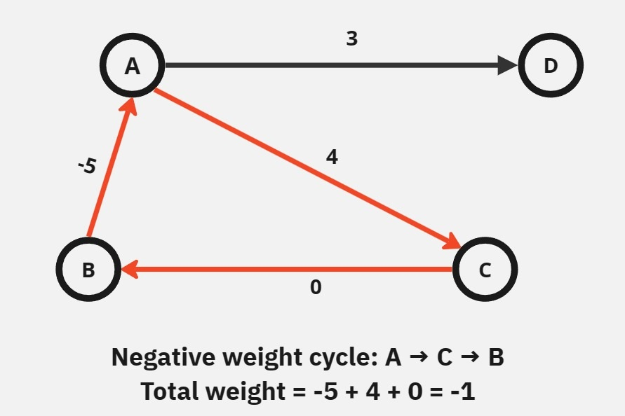
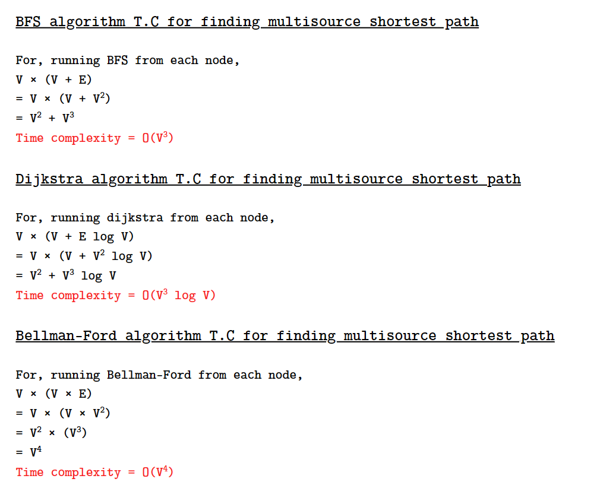

> # ```Bellman-Ford Algorithm```
Bellman ford is a graph shortest path algorithm that fixes limitations of greedy-based shortest path algorithm **Dijkstra**.

## Where **Dijkstra** algorithm fails
1. Can't predict shortest path if any negative weight cycle occurs (in an undirected graph).



> The negative weight cycle enters into an infinite loop by decreasing values it's value continuously. This problem can be solved by tracking which nodes have already been visited, and let not revisit again. But, the fix can also lead to an incorrect or undesired shortest path.

## How Bellamn-Ford algorithm fixes problem?

&nbsp;

> # ```Floyd Warshall Algorithm```
## Multi Source Shortest Path (MSSP)
Till now we've worked with graphs having a fixed source node and from that source we used to find shortest path to all other nodes or vertices. But, if we've to no fixed source node and said to find shortest path from each vertex. 



### When to use which algorithm
| **Criteria**         | **Algorithm**              |
| -------------------- | -------------------------- |
| Negative weight      | Floyd Warshall             |
| Only positive weight | Floyd Warshall or Dijkstra |
| No weight            | BFS                        |

Using Dijkstra and Bellman-Ford for finding multi source shortest path is not effecient. So, we have to use **Floyd Warshall** algorithm.

## How Floyd Warshall handle negative weight cycle? 

Check in the distance matrix, if the diagonal elements values become negative it means there is a cycle in the graph.

